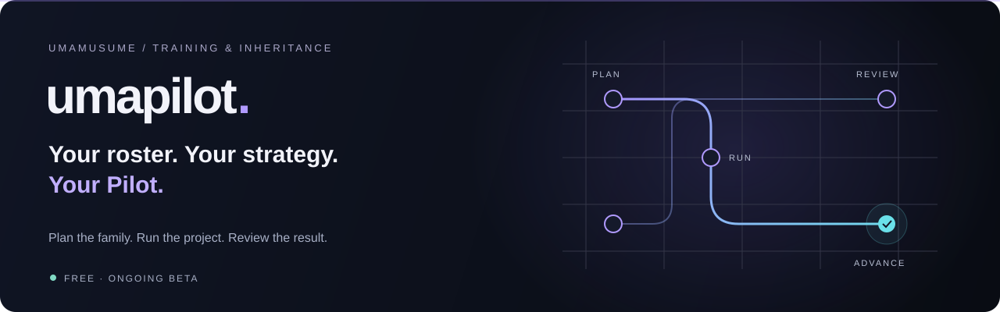
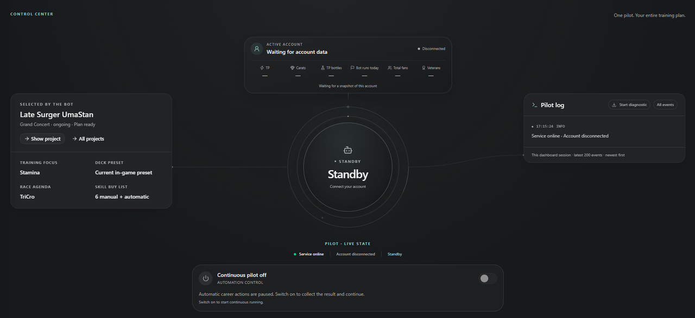
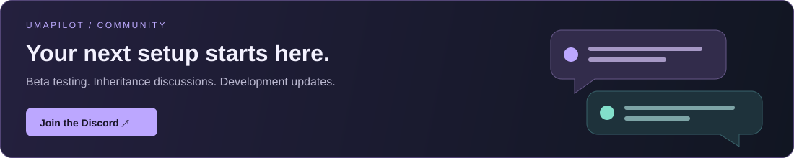
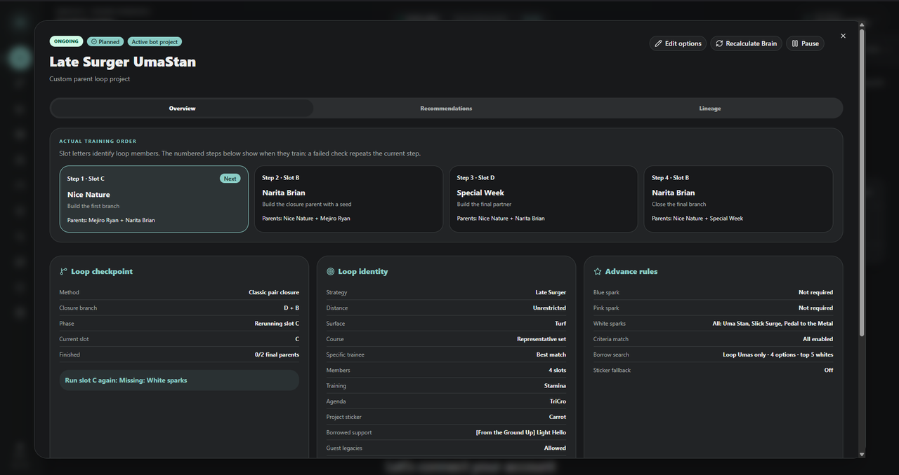
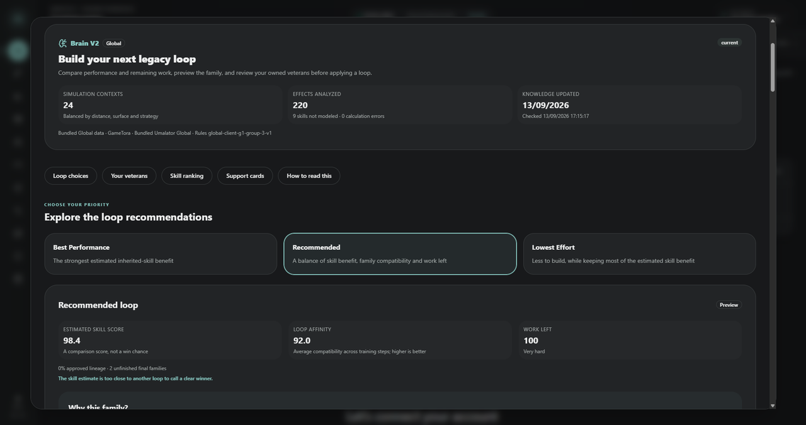

  

<h1 align="center">UmaPilot — Umamusume Global Bot</h1>

<strong>Independent Training automation &amp; inheritance planning.</strong> Build the parents. Shape the next ace.

  
  
  

FREE FEATURES &nbsp; · &nbsp; ONGOING BETA &nbsp; · &nbsp; WINDOWS 10 / 11 x64 &nbsp; · &nbsp; STEAM AUTHENTICATION

<a href="#features">Features</a> &nbsp; / &nbsp; <a href="#screenshots">Screenshots</a> &nbsp; / &nbsp; <a href="#getting-started">Get started</a> &nbsp; / &nbsp; <a href="#questions">FAQ</a>

**UmaPilot is a free bot for Umamusume: Pretty Derby Global.** It connects inheritance planning with automated Independent Training: compare parent loops around your roster, set your spark requirements, and let Pilot check each result before repeating or advancing the project.

Actual application screenshot · Pilot shown in standby · Click to enlarge.

> **🧪 Beta testing is ongoing.** Join the community to test UmaPilot, discuss inheritance setups and help improve the next release.

## 💬 Join the community

Questions about a setup? A project worth sharing? Come discuss it with us on **[the UmaPilot Discord](https://discord.gg/7kqnzP2bKG)**.

## ✨ Features

<table>
<tr>
<td width="50%" valign="top">
<h3>🧬 Inheritance projects</h3>
Your objective, parent family, training order and spark requirements together. Keep a checkpoint so every result has a next step.
</td>
<td width="50%" valign="top">
<h3>🧠 Brain recommendations</h3>
Compare loops using your roster, family compatibility and simulated skill benefit. Choose Best Performance, Recommended or Lowest Effort.
</td>
</tr>
<tr>
<td width="50%" valign="top">
<h3>🏁 Independent Training</h3>
Let Pilot manage Grand Concert Independent Training within your project, checking whether each result meets your acceptance rules.
</td>
<td width="50%" valign="top">
<h3>✨ Spark checks &amp; progress</h3>
Repeat the current step when requirements are missing. Advance the family plan when an accepted veteran is ready.
</td>
</tr>
<tr>
<td width="50%" valign="top">
<h3>🖥️ Headless execution</h3>
Direct game API communication with Steam authentication. No installed game files, visible game window or Android emulator required.
</td>
<td width="50%" valign="top">
<h3>🔔 Discord notifications</h3>
Receive veteran results, sparks, stats and the next project step through your own Discord webhook.
</td>
</tr>
</table>

## 📸 Inside UmaPilot

### Plan → Run → Review → Repeat

1. **Choose the goal.** Define the sparks your results need to carry.
2. **Review the family.** Compare routes and inspect parents, grandparents and training order.
3. **Start Pilot.** Run the project and let its acceptance rules determine the next step.

<strong>🧬 Project overview — your family plan and next action</strong>

 

Actual application screenshot · Training order, spark requirements and checkpoint in one project.

<strong>🧠 Brain — compare performance, compatibility and effort</strong>

 

Brain weighs estimated inherited-skill benefit, family compatibility and the work left to build the plan. Simulation-informed comparisons use Umalator and community data.

Scores compare options for your project; they are not win probabilities.

## 🚀 Getting started

### 1 · Download the Windows installer

**[Download UmaPilotSetup.exe](https://github.com/Kairoli/UmaPilot_Global/releases/latest/download/UmaPilotSetup.exe)**, or open **[the latest release](https://github.com/Kairoli/UmaPilot_Global/releases/latest)** for its version, checksum and installation notes. Run the installer and use the proposed folder, or choose another empty folder.

| What you need | Details |
| :--- | :--- |
| Operating system | Windows 10 or 11, 64-bit |
| App window | Edge, Chrome or Brave |
| Game account | Your own Steam account with Umamusume Global in its library |
| UmaPilot account | Google sign-in or a verified email address |
| During execution | Keep the machine powered on and connected |

The installer bundles Python, Node.js and the application. You do not need Git, development tools or installed game files. Allow extra disk space for installation, updates and your saved data; the current download and installed sizes are listed in each release.

GitHub's automatic “Source code” archives contain this presentation repository and are **not the installer**. Only `UmaPilotSetup.exe` is needed to install; the `.sha256` and `setup-info.json` files provide verification information. The installer currently has no Authenticode publisher signature.

### 2 · Create your profile

Sign up and verify your email with the code, or use Google sign-in. You can read the confirmation email on your phone or another computer, then enter the code in UmaPilot. Add your own Steam account in UmaPilot.

You can sign in to your UmaPilot account on another installation and load your cloud projects and settings. Different users can share an installation; each user's workspace is kept separate.

From v0.2.7, diagnostics and usage reporting are enabled by default to help identify broken updates. You can switch this off in **Profile → Diagnostics and usage reporting**. Reports include the app version, module activity, run totals and sanitized error codes; they do not include raw logs, passwords, Steam tokens, webhook addresses or game-account names. The overview covers 30 days of activity and affected users, with 90 days of daily totals. Expired records are removed during reporting; active error groups retain their lifetime count.

### 3 · Build your first project

Set your objective, review the family and spark requirements, then start Pilot. **[Join Discord](https://discord.gg/7kqnzP2bKG)** for beta guidance and setup discussions.

<strong>🔄 Already installed? Updating UmaPilot</strong>

Existing installations check the official signed update channel when launching. Follow the app's update instructions and restart when prompted; do not install over an existing nonempty folder. Internet access is required.

This repository automatically checks for a newer full installer every 30 minutes, although GitHub may delay scheduled jobs. The download button always points to its latest published installer. Installed apps use the original [UmaPilot-Releases update channel](https://github.com/Kairoli/UmaPilot-Releases/releases), so they can also update when a newer version is available there before this download mirror refreshes.

## ❓ Questions

<strong>Will UmaPilot be free?</strong>

Yes. All UmaPilot features will be free, with no features locked behind a paywall. If paid memberships are introduced in the future, they would only cover optional convenience, quality-of-life benefits or major external plugins, should any be developed.

<strong>Is Brain an AI chatbot?</strong>

No. Brain is a dedicated planning system that compares inheritance options using account data, family compatibility and simulation-informed skill evaluation. Rankings help compare routes; they do not guarantee race outcomes.

<strong>Does the game need to be installed?</strong>

No. The headless Windows edition uses Steam authentication and direct API communication without installed game files or a visible game client.

<strong>Does my computer need to stay on?</strong>

Yes. The machine running UmaPilot must stay powered on and connected. The website does not run your jobs. Discord webhooks send updates; they do not provide remote control.

<strong>Where are the application source and downloads?</strong>

UmaPilot_Global is the project's public presentation and Windows download repository. Get full installers from [this repository's releases](https://github.com/Kairoli/UmaPilot_Global/releases). Application source is maintained separately; this repository is not a buildable copy of the app. Detailed application changes and the signed update feed remain in [UmaPilot-Releases](https://github.com/Kairoli/UmaPilot-Releases/releases).

---

<strong>Every goal deserves a route.</strong>  
<a href="https://umapilot.com">Website</a> &nbsp; · &nbsp; <a href="https://discord.gg/7kqnzP2bKG">Discord community</a> &nbsp; · &nbsp; <a href="https://github.com/Kairoli/UmaPilot_Global/releases">Downloads &amp; release notes</a>  
UmaPilot is an independent project, not affiliated with or endorsed by Cygames. Umamusume and game assets belong to their respective owners.

